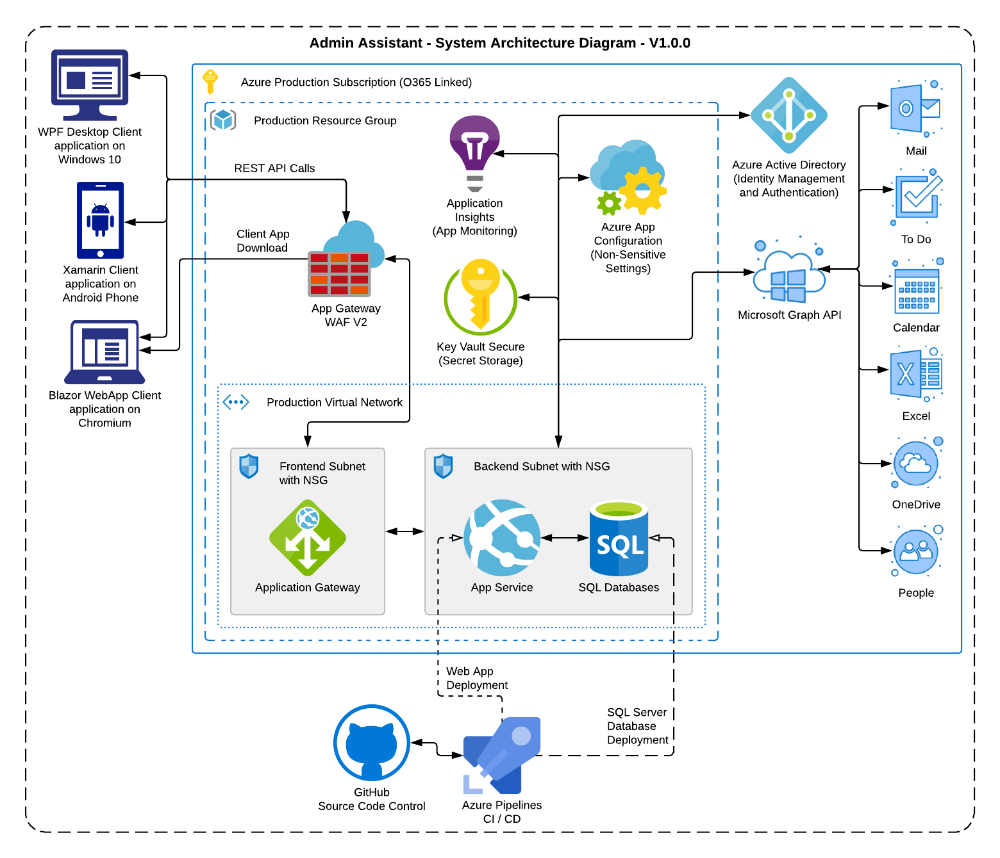
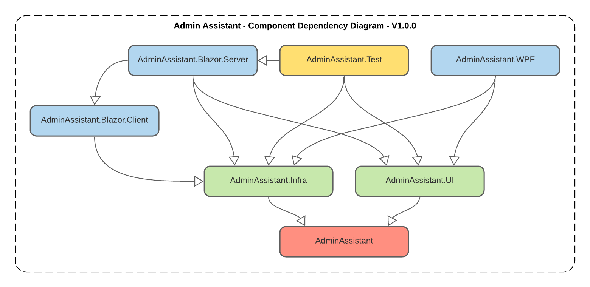

# Architecture  

## Overview

_TODO: Add a brief overview of describing the application architecture here._

## System Architecture Diagram

The following diagram gives an overview of the Admin Assistant system architecture as it would be when deployed in production on the Microsoft Azure Cloud Platform.  

_Fig 1. System Architecture Diagram for the Admin Assistant Application - (Click for larger size)_

## Component Dependency Diagram

The following diagram shows the relationships between the various components of the Admin Assistant system.  

_Fig 2. UML Component Diagram for the Admin Assistant Application - (Click for larger size)_
