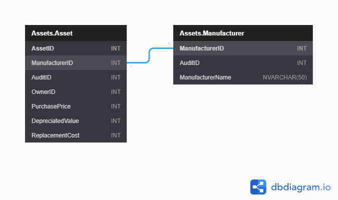

| [Issues](https://github.com/SimonGeering/AdminAssistant/milestone/12) | [Project Plan](https://github.com/SimonGeering/AdminAssistant/projects/4) | 

***

# Overview

TODO

## Use Case Diagram

TODO

# User Stories

- [ ] Manage Assets
  - [ ] Get list of Assets - See [Issue #128](https://github.com/SimonGeering/AdminAssistant/issues/128)
  - [ ] Create Asset - See [Issue #101](https://github.com/SimonGeering/AdminAssistant/issues/101)

## My Example User Story

``` Gherkin
Feature: Feature name
# As a <actor>
# I want to <functionality>
# So I can <business benefit>
```

# UI Design

a - [Example Screen Name](###Example Screen Name)  

## Screen Mockups

### Example Screen Name

TODO

# Database Schema

See <https://dbdiagram.io/d/5f5245dd88d052352cb5fdd1> or click the thumbnail below:  

[](https://simongeering.github.io/AdminAssistant/images/Asset-Register-Module/AssetsRegisterModule_EntityRelationshipDiagram_V1o0o0.png)  
_Fig 1. Database Entity Relationship Diagram for the Admin Assistant Asset Register Module - (Click for larger size)_
