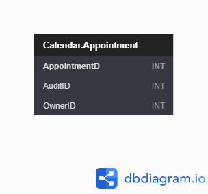

| [Issues](https://github.com/SimonGeering/AdminAssistant/milestone/8) | [Project Plan](https://github.com/SimonGeering/AdminAssistant/projects/7) | 

***

# Overview

TODO

## Use Case Diagram

TODO

# User Stories

- [ ] [My Example User Story](##My Example User Story) - See [Issue #xxx](https://github.com/SimonGeering/AdminAssistant/issues/xxx)  
- [ ] Create a scheduled Reminder - See [Issue #100](https://github.com/SimonGeering/AdminAssistant/issues/100)
- [ ] Get Reminders List - See [Issue #129](https://github.com/SimonGeering/AdminAssistant/issues/129)

## My Example User Story

``` Gherkin
Feature: Feature name
# As a <actor>
# I want to <functionality>
# So I can <business benefit>
```

# UI Design

a - [Example Screen Name](###Example Screen Name)  

## Screen Mockups

### Example Screen Name

TODO

# Database Schema

See <https://dbdiagram.io/d/5f5243d788d052352cb5fd81> or click the thumbnail below:  

[](https://simongeering.github.io/AdminAssistant/images/Calendar-Module/CalendarModule_EntityRelationshipDiagram_V1o0o0.png)  
_Fig 1. Database Entity Relationship Diagram for the Admin Assistant Calendar Module - (Click for larger size)_
