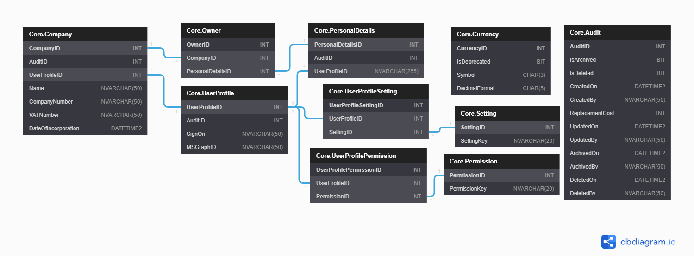

| [Issues](https://github.com/SimonGeering/AdminAssistant/milestone/14) | [Project Plan](https://github.com/SimonGeering/AdminAssistant/projects/1) | 

***

# Overview

TODO

## Use Case Diagram

TODO

# User Stories

- [x] [Support multiple currencies](#Support multiple currencies) - See [Issue #133](https://github.com/SimonGeering/AdminAssistant/issues/133)  

## Support multiple currencies

``` Gherkin
Feature: Pick a currency
# As a User
# I want to pick a currency from a list of available supported currencies
# So I can work with more than one currency
```

# UI Design

a - [Example Screen Name](###Example Screen Name)

## Screen Mockups

### Example Screen Name

TODO

# Database Schema

See <https://dbdiagram.io/d/5f5240d688d052352cb5fcf9> or click the thumbnail below:  

[](https://simongeering.github.io/AdminAssistant/images/Core-Module/CoreModule_EntityRelationshipDiagram_V1o0o0.png)  
_Fig 1. Database Entity Relationship Diagram for the Admn Assistant Core Module - (Click for larger size)_
