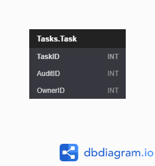

| [Issues](https://github.com/SimonGeering/AdminAssistant/milestone/9) | [Project Plan](https://github.com/SimonGeering/AdminAssistant/projects/12) | 

***

# Overview

TODO

## Use Case Diagram

TODO

# User Stories

- [ ] [My Example User Story](## My Example User Story) - See [Issue #xxx](https://github.com/SimonGeering/AdminAssistant/issues/xxx)
- [ ] Create Task - See [Issue #95](https://github.com/SimonGeering/AdminAssistant/issues/95)
- [ ] Get Task List - See [Issue #126](https://github.com/SimonGeering/AdminAssistant/issues/126)

## My Example User Story

``` Gherkin
Feature: Feature name
# As a <actor>
# I want to <functionality>
# So I can <business benefit>
```

# UI Design

a - [Example Screen Name](###Example Screen Name)

## Screen Mockups

### Example Screen Name

TODO

# Database Schema

See <https://dbdiagram.io/d/5f5244d788d052352cb5fdab> or click the thumbnail below:  

[](https://simongeering.github.io/AdminAssistant/images/Tasks-Module/TasksModule_EntityRelationshipDiagram_V1o0o0.png)  
_Fig 1. Database Entity Relationship Diagram for the Admin Assistant Tasks Module - (Click for larger size)_  
